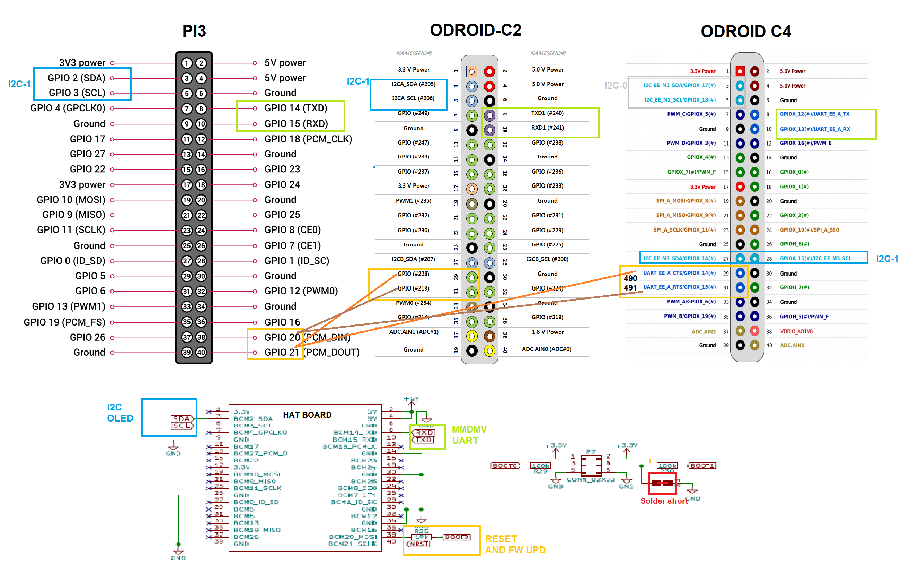

# Pi-star for ODROID-C2 and C4

**This is a modification of the famous pi-star DMR hotspot project:**  

https://www.pistar.uk/  
https://github.com/AndyTaylorTweet  

The repos are modified and files from the images are used.


## Hat


HW: https://github.com/phl0/MMDVM_HS_Dual_Hat/blob/master/hardware/r1.3/mmdvm_hs_dual_hat.pdf

FW: https://github.com/juribeparada/MMDVM_HS

## Boards


https://wiki.odroid.com/odroid-c2/odroid-c2


https://wiki.odroid.com/odroid-c4/odroid-c4

## OS

C2: [ubuntu-20.04-3.16-minimal-odroid-c2-20210201.img.xz](https://odroid.in/ubuntu_20.04lts/c2/ubuntu-20.04-3.16-minimal-odroid-c2-20210201.img.xz)

C4: [ubuntu-20.04-4.9-minimal-odroid-c4-hc4-20220228.img.xz](https://odroid.in/ubuntu_20.04lts/c4-hc4/ubuntu-20.04-4.9-minimal-odroid-c4-hc4-20220228.img.xz)

# Differences from Pi-star supported boards

 - [Pi-star](https://www.pistar.uk/downloads/) project provides **armhf** images for Pi and ODROID-XU4. Unfortunately, these don't run directly on C2 and C4 boards, which use **aarch64 (arm64)** OS.
 - Ubuntu images for C2/C4 mount a partition to **/media/boot** not to **/boot** so many pi-star scripts need a modification
 - 40-pin connectors on C2 and C4 look similar to Pi but they are different - especially the pins for hat reset / boot.
 - GPIO# are different for each board i.e. GPIO2xx for C2, not like Pi
 - Processors, chips ...

# Preparation



Connect the UART for main MMDMV communication, I2C for OLED type 3, and reset pins.

This HAT board needs soldering (shorting) of boot1 jumper to be able to program.

# SW Installation Steps

 - Flash a fresh Ubuntu OS image and boot the board
 - Use direct HDMA monitor and keyoboard or 
 - Get remote SSH Wired or WiFi by a USB dongle:
```
nmcli d wifi
nmcli d wifi connect XXXX password YYYY
systemctl status ssh
```
 - Login as root:odroid 
 - Add armhf arch: https://unix.stackexchange.com/questions/625576/how-to-run-32-bit-armhf-binaries-on-64-bit-arm64-debian-os-on-raspberry-pi
```
dpkg --add-architecture armhf
dpkg --print-architecture
dpkg --print-foreign-architectures 
``` 
 - Update / add OS stuff:
```
apt-get -y update && apt-get -y upgrade && apt-get -y dist-upgrade
apt autoremove && apt autoclean

apt install -y libstdc++6:armhf
apt install -y linux-libc-dev:armhf
apt install -y libc6-dev:armhf
```
 - Get the essentials from my extraction:
```
cd /tmp
wget https://github.com/ve2opn/Pi-Star-Odroid-C2-C4/releases/download/1.1/pi-odro-c2-4.tgz
# Just in case is not first time here
systemctl stop nginx
systemctl stop php7.0-fpm
tar zxvf pi-odro-c2-4.tgz -C /
```
 - Fix release strings, e.g use editor: nano /etc/pistar-release
 
**Odroid C2:**
```
[Pi-Star]
Pi-Star_Build_Date = 08-Feb-2021
Version = 4.1.4
ircddbgateway =	20181222
dstarrepeater = 20181222
MMDVMHost = 20200615_Pi-Star_v4
kernel = 3.16
Hardware = Odroid-C2
```
**Odroid C4:** :
```
[Pi-Star]
Pi-Star_Build_Date = 08-Feb-2021
Version = 4.1.4
ircddbgateway =	20181222
dstarrepeater = 20181222
MMDVMHost = 20200615_Pi-Star_v4
kernel = 4.9
Hardware = Odroid-C4
```
 - Add packages:
```
apt install -y ntp avahi-daemon miniupnpc file zip git curl net-tools parted rsync dosfstools python2 stm32flash
ln /usr/bin/python2 /usr/bin/python
```
 - Add and check PHP7.0: https://tecadmin.net/install-php-ubuntu-20-04/
```
apt install -y software-properties-common ca-certificates lsb-release apt-transport-https 
LC_ALL=C.UTF-8 add-apt-repository ppa:ondrej/php  
apt update 
apt install -y php7.0-cli php7.0-common php7.0-fpm php7.0-json php7.0-mbstring php7.0-opcache php7.0-readline php7.0-zip
apt list --installed | grep -i php
systemctl status php7.0-fpm
```
 - Add 2 users: (password raspberry)
```
adduser pi-star
adduser mmdvm
usermod -aG sudo pi-star
usermod -aG sudo mmdvm

# check the sudoers last lines should be like  pi-star ALL=(ALL) NOPASSWD: ALL www-data ALL=(ALL) NOPASSWD: ALL
visudo
# vi quitting is by Ctrl+
```
 - Add nginx:
```
apt install -y nginx
# default - keep when asking
# use q = quit from choices within test if you loop there
#
rm /etc/nginx/sites-enabled/default
systemctl start nginx
systemctl status nginx
```
 - Pi-star update, upgrade and add a script to run on startup
```
pistar-update
#again:
pistar-update
pistar-upgrade
#
crontab -e
# add a line at the end: 
@reboot  /home/pi-star/z_my.sh
```
 - Access the Web interface, activate the hat, change to your settings / restore conf. if you have one.
 - Check the modem and enable services
```
pistar-findmodem
systemctl daemon-reload
systemctl enable dapnetgateway.service
systemctl enable dgidgateway.service
systemctl enable dmr2nxdn.service
systemctl enable dmr2ysf.service
systemctl enable dmrgateway.service
systemctl enable dstarrepeater.service
systemctl enable ircddbgateway.service
systemctl enable mmdvmhost.service
systemctl enable mobilegps.service
systemctl enable nxdngateway.service
systemctl enable nxdnparrot.service
systemctl enable p25gateway.service
systemctl enable p25parrot.service
systemctl enable pistar-ap.service
systemctl enable pistar-remote.service
systemctl enable pistar-upnp.service
systemctl enable pistar-watchdog.service
systemctl enable ysf2dmr.service
systemctl enable ysf2nxdn.service
systemctl enable ysf2p25.service
systemctl enable ysfgateway.service
systemctl enable ysfparrot.service
reboot
```
 - **Odroid C2 only** : OLED on /dev/i2c-1, 3(SDA), 5(SCL) activate i2C-1: (permanent)
 ```
modprobe aml_i2c
echo "aml_i2c" | sudo tee /etc/modules
```
- Use this script for FW update of the HAT
```
/home/pi-star/install_fw_hsdualhat.sh
``` 
 - **Additional notes**  
a) Odroid C4 has issues with I2C so the OLED type 3 may not work.  
b) To ensure better startup, you can add a reset mmdvm hat line to **/home/pi-star/z_my.sh**
```
pistar-mmdvmhshatreset
# you can add pistar-update here, too
# comment all lines like /usr/local/sbin/aprsgateway.service start
```
c) **pistar-clone-c2** or **pistar-clone-c4** commands can be used to create a SD card image that fits to 4GB  
*Warning - it may destroy your working partition in case of errors!*  
**Verify UUID:** Mount the newly cloned partition and find by **blkid** command the UUID="xxxx....,   
Example, /dev/sdc2: UUID="96d8a621-b8f2-45b9-8f95-35bdbb83afc7" TYPE=...
```
blkid 
```
Check the line in the new **boot.ini** on cloned SD' first partition to match the cloned root partition UUID
```
setenv bootargs "root=UUID=96d8a621-b8f2-45b9-8f95-35bdbb83afc7 ...
```
**Also:** check for matching UUID in /etc/fstab
d) You can do this to recreate the essentials tgz file from your live system to /tmp:
```
tar zcvf /tmp/pi-odro-c2-4.tgz -T /home/pi-star/file-list
```
e) **shellinabox** - a forgotten package can be added to allow the shell in web interface
```
apt install shellinabox
systemctl enable shellinabox
nano /etc/default/shellinabox
```
replace the contents of the file - paste following into /etc/default/shellinabox
```
SHELLINABOX_DAEMON_START=1
SHELLINABOX_PORT=2222
SHELLINABOX_ARGS="--no-beep --disable-ssl-menu --disable-ssl --css=/etc/shellinabox/options-enabled/00_White\ On\ Black.css"
```
restart shellinabox
```
systemctl restart shellinabox
```
f) **firewall: iptables-persistent** - another package the can be added for persistent iptables 
```
pistar-firewall
apt install iptables-persistent
netfilter-persistent save
```
g) Enable the NextionDriver (for MMDVMHost) if you use such screen to enhance:
See: https://github.com/PD0DIB/NextionDriver#readme
```
nano /lib/systemd/system/nextion-helper.service
```
paste:
```
[Unit]
Description=Nextion Helper Service Service
After=syslog.target network.target
Before= mmdvmhost.service

[Service]
User=root
Type=forking
ExecStart=/usr/local/bin/NextionDriver -c /etc/mmdvmhost
ExecStop=/usr/bin/killall NextionDriver

[Install]
WantedBy=multi-user.target
```
modify to start together (or maybe not this way#)
```
nano /lib/systemd/system/mmdvmhost.service
```
paste:
```
[Unit]
Description=MMDVMHost Radio Servce
After=syslog.target network.target
#BindsTo=nextion-helper.service

[Service]
Type=forking
ExecStart=/usr/local/sbin/mmdvmhost.service start
ExecStop=/usr/local/sbin/mmdvmhost.service stop
ExecReload=/usr/local/sbin/mmdvmhost.service restart

[Install]
WantedBy=multi-user.target
```
enable the helper:
```
systemctl enable nextion-helper.service
```

## Useful links to setup your DMR Gateway 

https://github.com/g4klx/DMRGateway/wiki/Rewrite-Rules  

https://freestar.network/dmrplus-options-explained/  

https://freestar.network/tools/dmrplus-options-generator.php  

https://www.freedmr.uk/index.php/static-talk-groups-pi-star/


## Next
Similar boards to explore, they should work same way , example AML-S905X-CC, see 

[Here](https://www.aliexpress.com/item/1005005163398168.html)

[Here](https://www.loverpi.com/products/libre-computer-aml-s905x-cc-le-potato-with-heatsink-and-wifi-4?variant=39845153701946)


 - Enjoy
